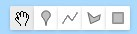

# GEDI in Google Earth Engine 

## Introductie

Aangezien voor het gebruik van GEDI over grotere gebieden (zoals bijvoorbeeld de volledige kustlijn of zelfs het volledige land), er enorm veel data moet gedownload, gefilterd en geprocessed worden lijkt het onhaalbaar om dit op een persoonlijke computer te doen.

Enter **Google Earth Engine**.

Google Earth Engine is praktischer voor het verwerken van grote hoeveelheden GEDI-data vanwege zijn schaalbaarheid, gedistribueerde infrastructuur, parallelle verwerking, geïntegreerde analyse-tools en gebruiksvriendelijke programmeeromgeving. Het platform biedt een efficiënte en snelle manier om complexe analyses uit te voeren op geospatiale datasets, waaronder GEDI Level-2A-data.

Daarnaast is het mogelijk om de GEDI-data te combineren met andere data; zoals Sentinel-1 en Sentinel-2, en in de toekomst hopelijk [NISAR](https://nisar.jpl.nasa.gov/) en [BIOMASS](https://www.esa.int/Applications/Observing_the_Earth/FutureEO/Biomass).

### Google Earth Engine: referenties

Deze training heeft tot doel de GEDI-dataset in Google Earth Engine verder te onderzoeken en te combineren met Sentinel-data voor het regionaal karteren van GEDI-afgeleide metrieken zoals kroonhoogte en biomassa.

Voor verdere introductie tot Google Earth Engine, verwijs ik naar enkele handige tutorials:

* [Introductie tot Google Earth Engine](https://users.ugent.be/~jfeyen/P2/P2-Goals.html) : practicumcursus van het vak Teledetectie aan de Universiteit van Gent (NL).

  
* [gee-tutorials]( https://google-earth-engine.com/): verzameling van tutorials in Google Earth Engine. Zowel de 'basics' als meer geavanceerde tutorials in verscheidene toepassingsvelden komen hier aan bod.


### GEDI-collectie in Google Earth Engine
De GEDI-datasets te gebruiken in Google Earth Engine zijn te vinden in de catalogus: [https://developers.google.com/earth-engine/datasets/tags/gedi](https://developers.google.com/earth-engine/datasets/tags/gedi)


# GEDI-dataset filteren, visualiseren en identificeren in Google Earth Engine

## A. Visualisatie van GEDI Level 2A shots

### Stap 1 - Inlezen van de GEDI-collectie: 

```Javascript
var GEDI_L2A = ee.ImageCollection('NASA/GEDI/Level2A'); 
```

Bekijken van de informatie van het eerste beeld:

```Javascript   
print('Eerste GEDI-beeld': GEDI_L2A.first())
```

Bekijk welke data voorhanden is: 

```Javascript   
print('Banden aanwezig': GEDI_L2A.first().bandNames())
```


### Stap 2 - Collectie filteren op locatie en datum

Momenteel is de GEDI-collectie nog een globale dataset. We wensen dit verder te filteren, zodat we enkel de datatsets overhouden die ons studiegebied overlappen, en binnen de gewenste timeframe horen. Filter de GEDI-gegevens op een bepaald gebied van belang (ROI) (zelf in te tekenen):

#### Region of Interest (ROI) intekenen

Starten doen we met het intekenen van een gewenste **Region Of Interest** (ROI) in de Map View. Een ROI is niets anders dan de afbakening van het studiegebied, waarbinnen we onze data wensen te verkrijgen.  

Er kan rechtstreeks gezoomd worden naar een locatie via de zoekbalk bovenaan of door het scrollen met de muis. Teken vervolgs een gewenste gebied in door gebruik te maken van de toolknoppen in de "Map View": .  

In dit voorbeeld kiezen we voor een stukje van de kustlijn, ter hoogte van Saramacca.


De geometrie komt nu automatisch in de 'Imports' bovenaan je script terecht. Hier kun je de naam van de variabele tevens aanpassen naar bijvoorbeeld 'ROI' (Region Of Interest).

Een andere optie; de 'Region of Interest' van de mangrove-zone aan de kustlijn intekenen?

```Javascript   
var ROI = ee.FeatureCollection('projects/ee-mangroves-suriname/assets/ROI_Mangrove_2022').first()

```
#### filteren op basis van regio (ROI)

Op basis van de ingetekende geometrie, kunnen we vervolgens de dataset gaan filteren op locatie. Hierbij worden alle GEDI-beelden die **overlappen** weerhouden. 

```Javascript
// Alleen de 'images' overlappend met de ROI worden weerhouden
var GEDI_L2A = GEDI_L2A.filterBounds(ROI);
```

#### filteren op basis van datum

Via de ```.filterDate()``` functie kunnen de beelden verder gefilterd worden op basis van data. 

```Javascript
// Temporeel Filteren: enkel de beelden binnen 2020 - 2021 behouden
var  GEDI_L2A = GEDI_L2A.filterDate('2020-01-01','2021-12-31');
```

#### eerste visualisatie van de GEDI-shots

We hebben ondertussen de GEDI-data gefilterd op basis van locatie en datum. We kunnen de resterende punten. Aangezien we nog over een **collectie** aan beelden (aggregatie van alle shots per maand) beschikken, dienen we dit eerst verder te reduceren naar één beeld.

Dit kunnen we doen op basis van zogenaamde 'reducers' zoals ```.mean()```, ```.median()```, ```.sum()```. We kunnen er hierbij van uitgaan dat er op elke locatie slechts één shot beschikbaar is.

Bij het plotten dienen we eerst de band (lees: de GEDI-metriek) die we wensen te visualiseren. Hier kiezen we voor de kroonhoogte, wat we gelijk stellen aan RH-waarde 98 (```rh98```).


```Javascript
// 
var visParams = {
  min: 0,
  max: 30,
  palette: 'darkred,red,orange,green,darkgreen'
};

// Functie om een laag te visualiseren
Map.addLayer(GEDI_L2A.select('rh98'), visParams, 'GEDI_L2A filtered')

```

Via de inspector: ), kun je de waarde individuele pixels gaan bekijken. 

<div class="alert alert-success">

**OEFENING**:

Identificeer verschillende pixels overheen het studiegebied. Tracht hierbij af te wisselen tussen verschillende vegetatietypes (op basis van een Google beeld). Kloppen de kroonhoogtes (rh98) met wat je hier zou verwachten?

</div>

#### filteren op basis van 'shot'-kwaliteit

Momenteel blijven er nog een relatief grote hoeveelheid aan puntdata over. Echter, niet elke 'GEDI'-waarde lijkt logisch.. Dit komt omdat er nog GEDI-shots aanwezig zijn met een slechte kwaliteit, als gevolg van een slecht signaal (door bijvoorbeeld zware wolken). Deze punten dienen we eerst nog uit de dataset te filteren.

Net zoals we bij de gedownloade data hebben gedaan, filteren we de shots **kwalitatief** op basis van de aanwezige 'quality'-banden.

Om voor elk overblijvend beeld in de ```Imagecollection``` de kwaliteitsfilter uit te voeren, schrijven we eerst een functie. Deze wordt daarna toegepast op de volledige collectie.

```Javascript
// Schrijven van kwaliteitsfilter

var qualityMask = function(image) {
  return image
      // Op basis van de 'quality flag'
       .updateMask(image.select('quality_flag').eq(1))
      // Op basis van de 'degrade flag'
       .updateMask(image.select('degrade_flag').eq(0))
      // Op basis van de Sensitivity
       .updateMask(image.select('sensitivity').gt(0.95))
      // Enkel de 'full power beams' (in GEE: BEAMS > 4
       .updateMask(image.select('beam').gt(4));
};

// Filter toepassen op elk beeld in de collectie. 
// De .map() functie
var GEDI_L2A = GEDI_L2A.map(qualityMask);
```


#### Visualisatie van de finale GEDI-dataset

In dit voorbeeld mappen we opnieuw RH98 = de kroonhoogte voor het eerste beeld

```Javascript
var visParams = {
  min: 0,
  max: 30,
  palette: 'darkred,red,orange,green,darkgreen'
};

Map.addLayer(GEDI_L2A.median().select('rh98'), visParams, 'GEDI rh98 2020/2021');
```


