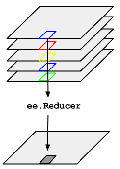

# Sentinel-2 zoeken en visualiseren in Google Earth Engine

Google Earth Engine heeft een ongeziene kracht om in enkele luttele lijntjes code doorheen vele petabytes aan aardobservatiedata te grasduinen

In wat volgt gaan we op basis van een locatie op zoek gaan naar geschikte satellietbeelden, door het filteren van gehele beeldcollecties.

## 1. Filteren van ```ImageCollections```

### Region of Interest (ROI)

Starten doen we met het intekenen van een gewenste **Region Of Interest** (ROI) in de Map View. Een ROI is niets anders dan de afbakening van het studiegebied, waarbinnen we onze data wensen te verkrijgen.  

Er kan rechtstreeks gezoomd worden naar een locatie via de zoekbalk bovenaan of door het scrollen met de muis. Teken vervolgs een gewenste gebied in door gebruik te maken van de toolknoppen in de "Map View": {: style="height:25px"}.  

### Inlezen en filteren van een ``` ImageCollection```

Voor deze oefening maken we gebruik van de Sentinel-1 en 2. Deze is terug te vinden in de data catalog: [https://developers.google.com/earth-engine/datasets/catalog/COPERNICUS_S2_SR_HARMONIZED](https://developers.google.com/earth-engine/datasets/catalog/COPERNICUS_S2_SR_HARMONIZED).

Om de voltallige Sentinel-2 data in te laden, maak je gebruik van onderstaande code:

```javascript
var S2 = ee.ImageCollection('COPERNICUS/S2_SR_HARMONIZED')
print('Grootte van de Sentinel-2-collectie :', S2.size())
```

Hiermee verwijst de variabele 'S2' naar de volledige Sentinel-2 collectie (surface reflectance). De '.size()'-functie berekent het aantal beelden dat in deze collectie zijn begrepen. Een hele hoop, sinds de collectie alle S2-beelden van de volledige aarde omvat. Om hier verder mee te werken dient de verzameling bijgevolg gefilterd te worden tot ons interessegebied en tijdstip. Filteren kan op basis van de metadata:

```javascript
//Filteren o.b.v. datum, locatie:
var S2 = S2.filterDate('2022-05-01', '2022-06-15') //Op basis van datum
           .filterBounds(ROI) //op basis van locatie (de AOI);

//Printen van de nieuwe grootte
print('S2 size na filtering',SE.size())

// Printen van de collectie voor inspectie
print('Filtered collection: ', SE)
```

De beelden in de collectie zijn standaard gesorteerd op datum. Indien we dus het eerste beeld uit de collectie  halen, zal dit het eerste Sentinel-2 beeld zijn gemaakt in mei 2021 van de ROI. Met de functie *.first()* halen we deze eruit.  Print deze naar de console en bekijk het verschil met de de Imagecollectie.

```javascript
// Krijg het eerste (standaard oudste) beeld uit de collectie:
var S2_first = S2.first()
print('Eerste Beeld:', S2_first)

```

We kunnen dit beeld visualiseren en naar het kaartvenster overbrengen:

```javascript
// Sentinel-2 visualisatie instellen.
var trueColor = {
  bands: ['B4', 'B3', 'B2'],
  min: 0,
  max: 3000,
};
Map.addLayer(S2_first, trueColor, 'Sentinel-2 first')
```

Mogelijk is dit eerste beeld niet het meest ideale wat betreft de wolkbedekking, waardoor er weinig te zien valt. Laten we nu op zoek gaan naar het beeld met de laagste wolkenbedekking binnen de collectie. Dit doen we in eerste instantie door de collectie te sorteren volgens het percentage cloudcover, wat standaard tot de metadata van een Sentinel-beeld behoort.

Bekijk het beeld. Wat valt je op? Wordt het volledige gebied bedekt?

```javascript
//Sorteren van de collectie obv cloud cover
var S2_sortedCC = S2sort('CLOUDY_PIXEL_PERCENTAGE',true);
Map.addLayer(S2_sortedCC.first(), trueColor, 'Least Cloud cover 2021/2022')

```
Bekijk op welke dag de sensor dit beeld heeft genomen. Gebruik hiervoor de ‘inspector’ om de beeldeigenschappen verder te bekijken.
    

## Cloud Masking

Wolkbedekking is een grote barrière tijdens het analyseren en processen van (spectrale) satellietbeelden. Recente satellietdata komen veelal ook met automatische classificaties van de wolkbedekking, waardoor deze relatief eenvoudig uit het beeld verwijderd kunnen worden.  

Earth engine bevat naast deze standaard ‘cloud masks’ ook algoritmes om de wolken en wolkschaduw te verwijderen uit het beeld. Een keten van filter, maskeer en reduce strategiën kan de aanwezigheid van wolken minimaliseren. Volgende 3 stappen kunnen onderdeel zijn van deze keten:

  1. Filteren op maximaal wolkenpercentage
  2. Cloudmasking algoritme toepassen om wolken te verwijderen
  3. Reduceren met een mediane reducer van de resterende collectie 

### 1. Filteren van de ImageCollection op wolkbedekking

Een eerste optie is om een beeldcollectie te filteren (zie [voorgaand](P2-ImageVisualization.md#datacollecties-filteren-en-visualiseren)) op wolkbedekking, waardoor enkel de beelden binnen een paalde range van wolkenpercentages worden weerhouden:

```javascript
// Voeg een extra filter in obv wolkbedekking ('Cloud_cover')
S2 = S2.filter(ee.Filter.lte('CLOUDY_PIXEL_PERCENTAGE',50)) 
```


### 2. Cloud Masks
Als 2e stap kunnen de overgebleven wolken/wolkschaduwen per beeld worden ‘geknipt’ (cloudmask) door deze pixels naar een waarde 0 om te zetten. Hiervoor maken we gebruik van 'metadata' die aan de Sentinel-2 beelden hangt, die de kans op een wolk per pixel bevat:

```javascript

// Definieren van CloudMask-functie (gegeven)

function maskS2clouds(image) {
  var qa = image.select('QA60');

  // Bits 10 and 11 are clouds and cirrus, respectively.
  var cloudBitMask = 1 << 10;
  var cirrusBitMask = 1 << 11;

  // Both flags should be set to zero, indicating clear conditions.
  var mask = qa.bitwiseAnd(cloudBitMask).eq(0)
      .and(qa.bitwiseAnd(cirrusBitMask).eq(0));

  return image.updateMask(mask).divide(10000);
}

// Pas de functie over elk beeld binnen de collectie toe met de .map-functie:
var S2_masked = S2.map(maskS2clouds);

// Eerste beeld uit collectie mét Cloudmask:
Map.addLayer(S2_masked.first(), trueColor, 'L9 - 1e beeld - met Cloudmask')
```
Resulterend is een ImageCollectie met dezelfde beelden, maar waaruit de wolken gemaskeerd zijn (mask toegepast). Echter kunnen wel sommige wolkenranden nog zichtbaar zijn, die de mask-functies hebben gemist.

### Finaal beeld aanmaken: reducing

Reducing’ een beeld- of datacollectie in Google Earth Engine is het proces waarbij de beeldcollectie wordt geaggregeerd over tijd, ruimte, banden, ....  

In dit proces wordt een beeldcomposiet aangemaakt van de beschikbare beelden in de collectie, waarbij per pixel een bepaalde vooropgestelde waarde wordt gekozen, zoals het min, max, gemiddelde, mediaan,… De collectie wordt als het ware 'gereduceerd' tot één enkel visualiseerbaar beeld.

<p align="center">
    <br>
  <em> Reducing an ImageCollection: principe. </em>
</p>  


```Javascript
// Mediane reducer toepassen: mediane pixelwaarde = beste kans om geen wolk/schaduw te hebben

var S2_image = S2_masked.median()
``


## EXTRA: Sentinel-2 Cloud Masking optie 2 met S2Cloudless

Onderstaande Sentinel-2 cloudmask-procedure is ter aanvulling van bovenstaande principes. Het betreft een relatief rest open-source cloudmask-algoritme dat gebruik maakt van een externe detector. Resultaten zijn doorgaans accurater dan de "standaard" cloud-masking functie gegeven bij de Sentinel-2 collectie. Er kan voor komende oefeningen/ het praktisch examen met beide procedures gewerkt worden, dus zoals wat in [Cloud Masking met Cloudmasks](#2-Cloud-Masking-met-Cloudmasks) werd gebruikt.

Deze Sentinel-2 cloudmasking functie steunt op een afzonderlijke collectie: [Sentinel-2 Cloud Probablity](https://developers.google.com/earth-engine/datasets/catalog/COPERNICUS_S2_CLOUD_PROBABILITY). Het wordt opgeroepen op basis van 2 functies:

```getS2_SR_CLOUD_PROBABILITY```: dat zowel de Sentinel-2 Surface Reflectance collectie oproept als de 'S2 cloud probability' collectie. Deze functie behoeft dus geen parameters en geeft een ImageCollectie als resultaat waarbij beide collecties met elkaar gemerged zijn per beeld.

```maskClouds```: dat op basis van de cloudprobability een cloudmask aanmaakt en toepast.

Om dus tot een collectie te komen waarbij de 'cloudmask' is toegepast, gebruik je dus onderstaande code:

```javascript
       var getS2_SR_CLOUD_PROBABILITY = function () {
              var innerJoined = ee.Join.inner().apply({
                  primary: ee.ImageCollection("COPERNICUS/S2_SR_HARMONIZED"),
                  secondary: ee.ImageCollection("COPERNICUS/S2_CLOUD_PROBABILITY"),
                  condition: ee.Filter.equals({
                    leftField: 'system:index',
                    rightField: 'system:index'
                  })
                });
              var mergeImageBands = function (joinResult) {
                  return ee.Image(joinResult.get('primary'))
                        .addBands(joinResult.get('secondary'));
                };
              var newCollection = innerJoined.map(mergeImageBands);
              return ee.ImageCollection(newCollection);
            };

            
   // Mask out clouds en scaling factor Sentinel-2
        var maskClouds = function(image) {
          var cloudProbabilityThreshold = 40;
          var cloudMask = image.select('probability').lt(cloudProbabilityThreshold);
          return image.updateMask(cloudMask).multiply(0.0001);
        };

var S2_coll = getS2_SR_CLOUD_PROBABILITY()
                .filterMetadata('CLOUDY_PIXEL_PERCENTAGE','less_than',50) //Voorselectie obv wolken
                .filterDate('2022-08-01','2022-10-15') 
                .map(maskClouds)

var S2_im = S2_coll.median()
```

## Sentinel-1 data

Dit laatste onderdeel vormt een introductie tot het verwerken en visualizeren van SAR-data in Google Earth Engine. SAR staat voor *'Synthetic Aperture Radar'* (NL: Apertuursyntheseradar). Het is wellicht het meest gebruikte type Radar-systeem binnen de Remote Sensing en biedt hoge resolutie radarbeelden. 

Het voordeel van Radar ten opzichte van multispectrale beelden:

- SAR-golven penetreren door wolkbedekking, waardoor wolken geen belemmering vormen tijden het monitoren van landbekking. Zeker in tropische landen is dit een sterk voordeel gedurende grote regenperiodes.

- Afhankelijk van het type SAR, penetreren de SAR-golven (gedeeltelijk) doorheen het kronendak, waardoor betere biomassa- en structuurinschattingen mogelijk worden. Over het algemeen geldt: hoe groter de golflengte, hoe dieper de SAR-golven penetreren.

- SAR remote sensing is een actieve vorm van teledetectie: de satelliet zorgt zelf voor energiebron. Hierdoor is het ook tijdsonafhankelijk en kan het zowel gedurende de dag als nacht opereren.

Bijgevolg zijn de meest frequente toepassingen van SAR bosmonitoring, flood mapping en disaster management,  [The SAR handbook (NASA, 2019)](https://servirglobal.net/Global/Articles/Article/2674/sar-handbook-comprehensive-methodologies-for-forest-monitoring-and-biomass-estimation) vormt een uitstekend handboek waar zowel de theoretische achtergrond als enkele toepassingen worden uitgelicht.

### Visualiseren van Sentinel-1 data

* Als eerste stap, filteren we de S1 collectie. Hierbij werken we uit eenvoud met de VV polarisatie. Let op de naamgeving van je studiegebied.


```javascript
// Inladen van Sentinel-1 collectie
var S1_VV = ee.ImageCollection('COPERNICUS/S1_GRD')
        //.filter(ee.Filter.listContains('transmitterReceiverPolarisation', 'VV'))
        .filterDate('2021-05-01','2021-10-31')
        .filter(ee.Filter.eq('instrumentMode', 'IW'))
        .filterBounds(ROI)
        .select('VV')
        .map(function(image) {
          var edge = image.lt(-30.0);
          var maskedImage = image.mask().and(edge.not());
          return image.updateMask(maskedImage);
          });

// Richting van S1-overtoch is van belang: hier enkel de 'descending' richting nemen
 var desc = S1_VV.filter(ee.Filter.eq('orbitProperties_pass', 'DESCENDING'));

var imgVV_2021 = desc.mean().focal_mean(smoothing_radius, 'circle', 'meters').select('VV');
var imgVH_2021 = desc.mean().focal_mean(smoothing_radius, 'circle', 'meters').select('VH');

Map.addLayer(imgVV_2021,{min:-23,max:0}'VV 2021')
            
```


#### Samenvoegen van Sentinel-1 en Sentinel-2 banden

Tot slot wensen we onze Sentinel-1 en Sentinel-2 data samen te voegen tot één grote banden-"stack". In GEE doe je dit via de ```.addBands()``` functie:

```Javascript
var Sentinel_2021 = SenS2_im.addBands(imgVV_2021).addBands(img_VH_2021)

```

#### Exporteren van data naar een Asset

Een "Asset" is een opgeslagen raster of vectorbestand op de Google cloud. Elke dataset die je aanmaakt kun je zo exporteren, waarna deze beschikbaar blijft voor andere projecten.

Een voordeel van deze methode is dat de hele 'processing'-keten voor het aanmaken van het beeld niet meer hoeft te gebeuren, waardoor ook de processing-stappen sneller zullen gaan bij het gebruiken van dit beeld.

Om een beeld op te slaan naar een Asset:


```Javascript
Export.image.toAsset({
  image: Sentinel_2021, // Het beeld dat je hebt aangemaakt
  description: 'Sentinel_2021', // Beschrijving
  scale: 10,  // Resolutie waarin je het wenst te exporteren
  maxPixels: 1e13,  // Rekenkracht verhogen
  region: ROI, 
  crs: "EPSG:32621" // Coordinatensysteem waarin de data geëxporteerd dient te worden
})
```

Op een gelijke manier kun je ook data exporteren naar je Google Drive, als bijvoorbeeld een ```.tif```-file. Dit kun je dan verder gebruiken binnen andere GIS-software, zoals QGIS,...


```Javascript
Export.image.toDrive({
  image: Sentinel_2021, // Het beeld dat je hebt aangemaakt
  description: 'Sentinel_2021', // Beschrijving
  scale: 10,  // Resolutie waarin je het wenst te exporteren
  maxPixels: 1e13,  // Rekenkracht verhogen
  region: ROI, 
  folder : 'GEE exports', // Folder op je Google Drive (wordt aangemaakt indien deze nog niet bestaat)
  crs: "EPSG:32621" // Coordinatensysteem waarin de data geëxporteerd dient te worden
})
