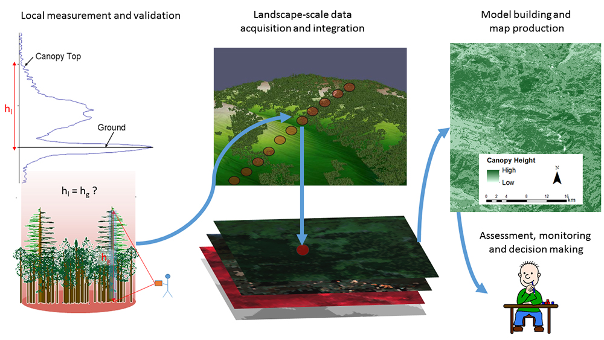

# Modelleren van GEDI-afgeleide structuurdata (Canopy Height & Biomassa) op basis van Sentinel-1 en -2 data

GEDI-datasets zijn discreet: de missie maakt slechts **samples** van het aardoppervlak op basis van shots. Toch zijn we doorgaans geïnteresseerd om gebiedsdekkende informatie te verkrijgen omtrent kroonhoogte, biomassa, ...

Om dit te doen, kunnen we aan de hand andere remote sensing data een model opstellen, om deze 'gebiedsdekkende' extrapolatie mogelijk te maken. In onderstaand voorbeeld wordt een *simpele* regressie gemaakte tussen de banddata afkomstig van Sentinel-1 en 2 en de GEDI-afgeleide metrieken zoals de hoogte van het kronendak (rh98) en de biomassawaarde, zoals onderstaande figuur suggereert:



## Toevoegen van Sentinel-1 en Sentinel-2 data

! Voor het aanmaken van een Sentinel-1/2 beeld wordt verwezen naar de extra notebook, die de stappen behandelt voor het filteren en reduceren van de Sentinel-1 en 2 collecties. 

Onderstaande code voegt een Sentinel-2 en Sentinel-1 beeld toe voor het studiegebied (ROI). Volgende zaken worden toegepast:

* Gefilterd op het jaar 2021 en wolkbedekking van maximaal 50%
* Wolken werden verwijderd
* Voor Sentinel-1: 'speckle' filter toegepast.
* Mediaan-reducer op resterende beelden

Om aan 'rekenkracht' te besparen, laden we een reeds aangemaakt Sentinel-2 beeld voor 2021 in. Gezien deze al in de 'cloud' bestaat, moet Earth Engine geen extra achterliggende berekeningen uitvoeren, wat de looptijd grondig zal beperken.


```Javascript
// Inladen van een vooraf aangemaakt Sentinel-1/2 beeld (dit kun je vervangen door je eigen beeld)
var Sentinel_2021 = ee.Image('projects/ee-mangroves-suriname/assets/Sentinel_2021')

// Visualisatie van een RGB-beeld:
Map.addLayer(Sentinel_2021,{min:0, max:0.3, bands: ['B4','B3','B2']},'Sentinel 2021')
```

#### Stap 5 - GEDI/Sentinel-1/2 dataset opstellen

Voor modelleren van de GEDI-afgeleide structuurdata (zoals RH95) functioneren de GEDI-shots als "dataset" voor het maken van een regressie. Hierbij delen we de dataset eerst op in een train- en validatieset, om de accuraatheid van het model na te gaan:

```Javascript
// We dienen onze GEDI-pixels om te zetten naar een ```FeatureCollection```, zodat we beschikken over een 'puntenset'

//Via de .sample-functie, plaatsen we over elke pixel een punt
var GEDI_L2A = GEDI_L2A.select('rh95').sample({
  region: ROI,
  scale: 25,
  geometries: true
})

// Over hoeveel GEDI-punten beschikken we?
print('Aantal GEDI-punten ': GEDI_L2A.size())

```
We beschikken nog over een gigantische dataset aan punten. Zelfs voor Google Earth Engine is dit veel (lees: je kunt elk punt wel gebruiken, maar hiervoor dien je te werken met een rechtstreekse 'export', wat enkele uren in beslag kan nemen). Om een snellere berekening mogelijk te maken, reduceren we deze set;

```Javascript
// Toevoegen van randomColumn
var GEDI_L2A = GEDI_L2A.randomColumn('random')

var GEDI_L2A = GEDI_L2A.filter(ee.Filter.lt('random',0.3))

print(GEDI_L2A.size(), ' punten na reductie')
```

Vervolgens kunnen we de pixel-waarden uit de Sentinel-1/2 data toevoegen aan onze set d.m.v. SampleRegions. 

```Javascript
// Get bandNames
var bands = Sentinel_2021.bandNames() 

// Extract data
var GEDI_S2 = Sentinel_2021.select(bands).sampleRegions({
  collection: GEDI_L2A,
  properties: ['rh95'],
  scale: 25 ,
  geometries : true,
  });
```

Dit levert een nieuwe dataset op met volgende gegevens:

```Javascript
print('GEDI Dataset :' , GEDI_S2.propertyNames())
```
#### Stap 6: Dataset splitsen in train & validatie data

Vervolgens kunnen we de datset opsplitsen in een training- en validatieset. Dit doen we eveneens door het toevoegen van een random kolom, waarop we de datset splitsen in 70% traindata en 30% validatiedata

```Javascript
// Toevoegen van randomColumn
var GEDI_S2 = GEDI_S2.randomColumn('random2')

// Opsplitsen
var training = GEDI_S2.filter(ee.Filter.lt('random2',0.7))
var validation = GEDI_S2.filter(ee.Filter.gte('random2',0.7))
```

#### Stap 7: Regressiemodel aanmaken

Vervolgens komen we aan de kern van de oefening:

We wensen een model te maken, waarbij de 'RH98'-attribuut van GEDI (= Kroonhoogte) wordt voorspeld door de Sentinel-1/2 banden. Onderstaande illustratie geeft dit visueel weer:


Dit doen we aan de hand van een Random Forest regressie-model.


```Javascript
// Build Random Forest regressor
var classifier = ee.Classifier.smileRandomForest(100, null, 1, 0.5, null, 0)
  .setOutputMode('REGRESSION')
  .train({
    features: training,
    classProperty: 'rh95',
    inputProperties: bands
    });
    
  
var regression = Sentinel_2021.select(bands).classify(classifier, 'predicted');

var palettes = require('users/gena/packages:palettes');
var palette = palettes.crameri.nuuk[25];

// Display the input imagery and the regression classification.
  // get dictionaries of min & max predicted value
  var regressionMin = (regression.reduceRegion({
    reducer: ee.Reducer.min(),
    scale: 25, 
    bestEffort: true,
    tileScale: 5
  }));
  var regressionMax = (regression.reduceRegion({
    reducer: ee.Reducer.max(),
    scale: 25, 
    bestEffort: true,
    tileScale: 5
  }));
  
// Add to map
var viz = {palette: palette, min: regressionMin.getNumber('predicted').getInfo(), max: regressionMax.getNumber('predicted').getInfo()};
Map.addLayer(regression, viz, 'Regression');

```

#### Stap 8: Evaluatie van het model
Tot slot kunnen we het model evalueren op basis van de onafhankelijke validatie-dataset die we aanmaakten.

Voor deze punten zullen we een predictie maken door het model, en deze vergelijken met de werkelijke waarde.

Op basis van de afgeleide 'R2'-waarde krijgen we een beeld van hoe 'accuraat' de voorspelling is.

```Javascript
// Get predicted regression points in same location as training data
var predictedTraining = regression.sampleRegions({collection:validation, geometries: true});
// Separate the observed (rh98) and predicted (regression) properties
var sampleTraining = predictedTraining.select(['predicted','rh98']);
// Create chart, print it
var chartTraining = ui.Chart.feature.byFeature(sampleTraining, 'predicted', 'rh95')
.setChartType('ScatterChart').setOptions({
title: 'Predicted vs Observed - Training data ',
hAxis: {title: 'observed', viewWindow: {min: 0, max: 50},},
vAxis: {title: 'predicted', viewWindow: {min: 0, max: 50},},
pointSize: 3,
trendlines: { 0: {showR2: true, visibleInLegend: true} ,
1: {showR2: true, visibleInLegend: true}}});
print(chartTraining);
```

#### Stap 9: Identificatie van de meest belangrijke banden

```Javascript
// Get variable importance
var dict = classifier.explain();
print("Classifier information:", dict);
var variableImportance = ee.Feature(null, ee.Dictionary(dict).get('importance'));
// Make chart, print it
var chart =
ui.Chart.feature.byProperty(variableImportance)
.setChartType('ColumnChart')
.setOptions({
title: 'Random Forest Variable Importance',
legend: {position: 'none'},
hAxis: {title: 'Bands'},
vAxis: {title: 'Importance'}
});
print(chart);
```


