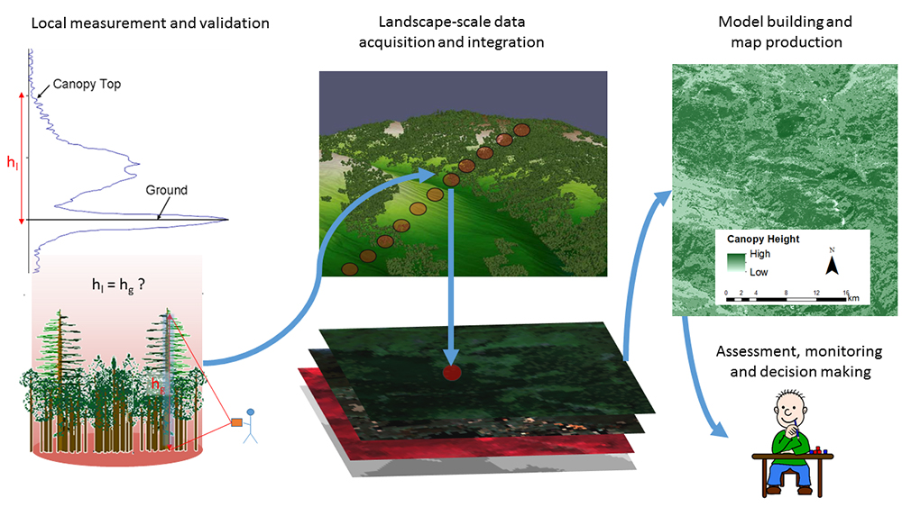

# GEDI in Google Earth Engine 

## Introductie

Aangezien voor het gebruik van GEDI over grotere gebieden (zoals bijvoorbeeld de volledige kustlijn of zelfs het volledige land), er enorm veel data moet gedownload, gefilterd en geprocessed worden lijkt het onhaalbaar om dit op een persoonlijke computer te doen.

Enter **Google Earth Engine**.

Google Earth Engine is praktischer voor het verwerken van grote hoeveelheden GEDI-data vanwege zijn schaalbaarheid, gedistribueerde infrastructuur, parallelle verwerking, geïntegreerde analyse-tools en gebruiksvriendelijke programmeeromgeving. Het platform biedt een efficiënte en snelle manier om complexe analyses uit te voeren op geospatiale datasets, waaronder GEDI Level-2A-data.

Daarnaast is het mogelijk om de GEDI-data te combineren met andere data; zoals Sentinel-1 en Sentinel-2, en in de toekomst hopelijk [NISAR](https://nisar.jpl.nasa.gov/) en [BIOMASS](https://www.esa.int/Applications/Observing_the_Earth/FutureEO/Biomass).

### Google Earth Engine: referenties

Deze training heeft tot doel de GEDI-dataset in Google Earth Engine verder te onderzoeken en te combineren met Sentinel-data voor het regionaal karteren van GEDI-afgeleide metrieken zoals kroonhoogte en biomassa.

Voor verdere introductie tot Google Earth Engine, verwijs ik naar enkele handige tutorials:

* [Introductie tot Google Earth Engine](https://users.ugent.be/~jfeyen/P2/P2-Goals.html) : practicumcursus van het vak Teledetectie aan de Universiteit van Gent (NL).

  
* [gee-tutorials]( https://google-earth-engine.com/): verzameling van tutorials in Google Earth Engine. Zowel de 'basics' als meer geavanceerde tutorials in verscheidene toepassingsvelden komen hier aan bod.


### GEDI-collectie in Google Earth Engine
De GEDI-datasets te gebruiken in Google Earth Engine zijn te vinden in de catalogus: [https://developers.google.com/earth-engine/datasets/tags/gedi](https://developers.google.com/earth-engine/datasets/tags/gedi)


## Start-to-GEDI in Google

### A. Visualisatie van GEDI Level 2A shots

#### Stap 1 - Inlezen van de GEDI-collectie: 

```Javascript
var GEDI_L2A = ee.ImageCollection('NASA/GEDI/Level2A'); 
```

Bekijken van de informatie van het eerste beeld:

```Javascript   
print('Eerste GEDI-beeld': GEDI_L2A.first())
```

Bekijk welke data voorhanden is: 

```Javascript   
print('Banden aanwezig': GEDI_L2A.first().bandNames())
```

#### Stap 2 - Collectie filteren op locatie en datum

Subsetten van GEDI-gegevens: Filter de GEDI-gegevens op een bepaald gebied van belang (ROI) (zelf in te tekenen):

 ROI = ee.Geometry.Rectangle([xmin, ymin, xmax, ymax]); // Vervang xmin, ymin, xmax, ymax met de coördinaten van je ROI

```Javascript   
var ROI = ee.FeatureCollection('projects/ee-mangroves-suriname/assets/ROI_Mangrove_2022').first()
// Alleen elementen overlappend met ROI
var GEDI_L2A = GEDI_L2A.filterBounds(ROI);

// Temporeel Filteren: enkel datavan 2020 overhouden
var  GEDI_L2A = GEDI_L2A.filterDate('2020-01-01','2021-12-31');
```

Net zoals we bij de gedownloade data hebben gedaan, dienen we de shots ook **kwalitatief** te filteren, op basis van de attribuutdata.

Hiervoor schrijven we een functie die per beeld in de collectie de pixels filterts op basis van deze kwaliteitsnormen:

```Javascript
var qualityMask = function(image) {
  return image
      // Op basis van de 'quality flag'
       .updateMask(image.select('quality_flag').eq(1))
      // Op basis van de 'degrade flag'
       .updateMask(image.select('degrade_flag').eq(0))
      // Op basis van de Sensitivity
       .updateMask(image.select('sensitivity').gt(0.95))
      // Enkel de 'full power beams' (in GEE: BEAMS > 4
       .updateMask(image.select('beam').gt(4));
};

// Mask toepassen op elk beeld in de collectie:
var GEDI_L2A_filtered = GEDI_L2A.map(qualityMask);
```


#### Stap 3 - Eerste Visualisatie van de GEDI-shots

In dit voorbeeld mappen we RH98 = de kroonhoogte voor het eerste beeld

```Javascript
var visParams = {
  min: 0,
  max: 30,
  palette: 'darkred,red,orange,green,darkgreen'
};

Map.addLayer(GEDI_L2A.first().select('rh98'), visParams, 'GEDI rh98 Jan 2020');
```
#### Stap 4 - Data samenvoegen

Momenteel hebben we nog een collectie met een GEDI-beeld per maand. Deze data wensen we te aggregeren via een 'reducer'. Voor de overblijvende shots (= pixels) maken we dus één beeld aan. 

We kunnen er van uitgaan dat er geen overlappende pixels (dus shots) aanwezig zijn. Daarom zal zowel de ```.mean()`` als de ```.median()``` reducer hetzelfde resultaat opleveren


```javascript
var GEDI_L2A = GEDI_L2A.mean()

Map.addLayer(Map.addLayer(GEDI_L2A.first().select('rh98'), visParams, 'GEDI rh98 2020/2021');
```

#### Stap 5: Toevoegen van Sentinel-1 en Sentinel-2 data

Onderstaande code voegt een Sentinel-2 en Sentinel-1 beeld toe voor het studiegebied (ROI). Volgende zaken worden toegepast:

* Gefilterd op het jaar 2021 en wolkbedekking van maximaal 50%
* Wolken werden verwijderd
* Voor Sentinel-1: 'speckle' filter toegepast.
* Mediaan-reducer op resterende beelden

Om aan 'rekenkracht' te besparen, laden we een reeds aangemaakt Sentinel-2 beeld voor 2021 in. Gezien deze al in de 'cloud' bestaat, moet Earth Engine geen extra achterliggende berekeningen uitvoeren, wat de looptijd grondig zal beperken.


```Javascript
var Sentinel_2021 = ee.Image('projects/ee-mangroves-suriname/assets/Sentinel_2021')

// Visualisatie van een RGB-beeld:
Map.addLayer(Sentinel_2021,{min:0, max:0.3, bands: ['B4','B3','B2']},'Sentinel 2021')
```

#### Stap 5 - GEDI/Sentinel-1/2 dataset opstellen

Voor modelleren van de GEDI-afgeleide structuurdata (zoals RH95) functioneren de GEDI-shots als "dataset" voor het maken van een regressie. Hierbij delen we de dataset eerst op in een train- en validatieset, om de accuraatheid van het model na te gaan:

```Javascript
// We dienen onze GEDI-pixels om te zetten naar een ```FeatureCollection```, zodat we beschikken over een 'puntenset'

//Via de .sample-functie, plaatsen we over elke pixel een punt
var GEDI_L2A = GEDI_L2A.select('rh95').sample({
  region: ROI,
  scale: 25,
  geometries: true
})

// Over hoeveel GEDI-punten beschikken we?
print('Aantal GEDI-punten ': GEDI_L2A.size())

```
We beschikken nog over een gigantische dataset aan punten. Zelfs voor Google Earth Engine is dit veel (lees: je kunt elk punt wel gebruiken, maar hiervoor dien je te werken met een rechtstreekse 'export', wat enkele uren in beslag kan nemen). Om een snellere berekening mogelijk te maken, reduceren we deze set;

```Javascript
// Toevoegen van randomColumn
var GEDI_L2A = GEDI_L2A.randomColumn('random')

var GEDI_L2A = GEDI_L2A.filter(ee.Filter.lt('random',0.3))

print(GEDI_L2A.size(), ' punten na reductie')
```

Vervolgens kunnen we de pixel-waarden uit de Sentinel-1/2 data toevoegen aan onze set d.m.v. SampleRegions. 

```Javascript
// Get bandNames
var bands = Sentinel_2021.bandNames() 

// Extract data
var GEDI_S2 = Sentinel_2021.select(bands).sampleRegions({
  collection: GEDI_L2A,
  properties: ['rh95'],
  scale: 25 ,
  geometries : true,
  });
```

Dit levert een nieuwe dataset op met volgende gegevens:

```Javascript
print('GEDI Dataset :' , GEDI_S2.propertyNames())
```
#### Stap 6: Dataset splitsen in train & validatie data

Vervolgens kunnen we de datset opsplitsen in een training- en validatieset. Dit doen we eveneens door het toevoegen van een random kolom, waarop we de datset splitsen in 70% traindata en 30% validatiedata

```Javascript
// Toevoegen van randomColumn
var GEDI_S2 = GEDI_S2.randomColumn('random2')

// Opsplitsen
var training = GEDI_S2.filter(ee.Filter.lt('random2',0.7))
var validation = GEDI_S2.filter(ee.Filter.gte('random2',0.7))
```

#### Stap 7: Regressiemodel aanmaken

Vervolgens komen we aan de kern van de oefening:

We wensen een model te maken, waarbij de 'RH98'-attribuut van GEDI (= Kroonhoogte) wordt voorspeld door de Sentinel-1/2 banden. Onderstaande illustratie geeft dit visueel weer:




Dit doen we aan de hand van een Random Forest regressie-model.


```Javascript
// Build Random Forest regressor
var classifier = ee.Classifier.smileRandomForest(100, null, 1, 0.5, null, 0)
  .setOutputMode('REGRESSION')
  .train({
    features: training,
    classProperty: 'rh95',
    inputProperties: bands
    });
    
  
var regression = Sentinel_2021.select(bands).classify(classifier, 'predicted');

var palettes = require('users/gena/packages:palettes');
var palette = palettes.crameri.nuuk[25];

// Display the input imagery and the regression classification.
  // get dictionaries of min & max predicted value
  var regressionMin = (regression.reduceRegion({
    reducer: ee.Reducer.min(),
    scale: 25, 
    bestEffort: true,
    tileScale: 5
  }));
  var regressionMax = (regression.reduceRegion({
    reducer: ee.Reducer.max(),
    scale: 25, 
    bestEffort: true,
    tileScale: 5
  }));
  
// Add to map
var viz = {palette: palette, min: regressionMin.getNumber('predicted').getInfo(), max: regressionMax.getNumber('predicted').getInfo()};
Map.addLayer(regression, viz, 'Regression');

```

#### Stap 8: Evaluatie van het model
Tot slot kunnen we het model evalueren op basis van de onafhankelijke validatie-dataset die we aanmaakten.

Voor deze punten zullen we een predictie maken door het model, en deze vergelijken met de werkelijke waarde.

Op basis van de afgeleide 'R2'-waarde krijgen we een beeld van hoe 'accuraat' de voorspelling is.

```Javascript
// Get predicted regression points in same location as training data
var predictedTraining = regression.sampleRegions({collection:validation, geometries: true});
// Separate the observed (REDOX_CM) and predicted (regression) properties
var sampleTraining = predictedTraining.select(['predicted','rh95']);
// Create chart, print it
var chartTraining = ui.Chart.feature.byFeature(sampleTraining, 'predicted', 'rh95')
.setChartType('ScatterChart').setOptions({
title: 'Predicted vs Observed - Training data ',
hAxis: {title: 'observed', viewWindow: {min: 0, max: 50},},
vAxis: {title: 'predicted', viewWindow: {min: 0, max: 50},},
pointSize: 3,
trendlines: { 0: {showR2: true, visibleInLegend: true} ,
1: {showR2: true, visibleInLegend: true}}});
print(chartTraining);
```

#### Stap 9: Identificatie van de meest belangrijke banden

```Javascript
// Get variable importance
var dict = classifier.explain();
print("Classifier information:", dict);
var variableImportance = ee.Feature(null, ee.Dictionary(dict).get('importance'));
// Make chart, print it
var chart =
ui.Chart.feature.byProperty(variableImportance)
.setChartType('ColumnChart')
.setOptions({
title: 'Random Forest Variable Importance',
legend: {position: 'none'},
hAxis: {title: 'Bands'},
vAxis: {title: 'Importance'}
});
print(chart);
```


